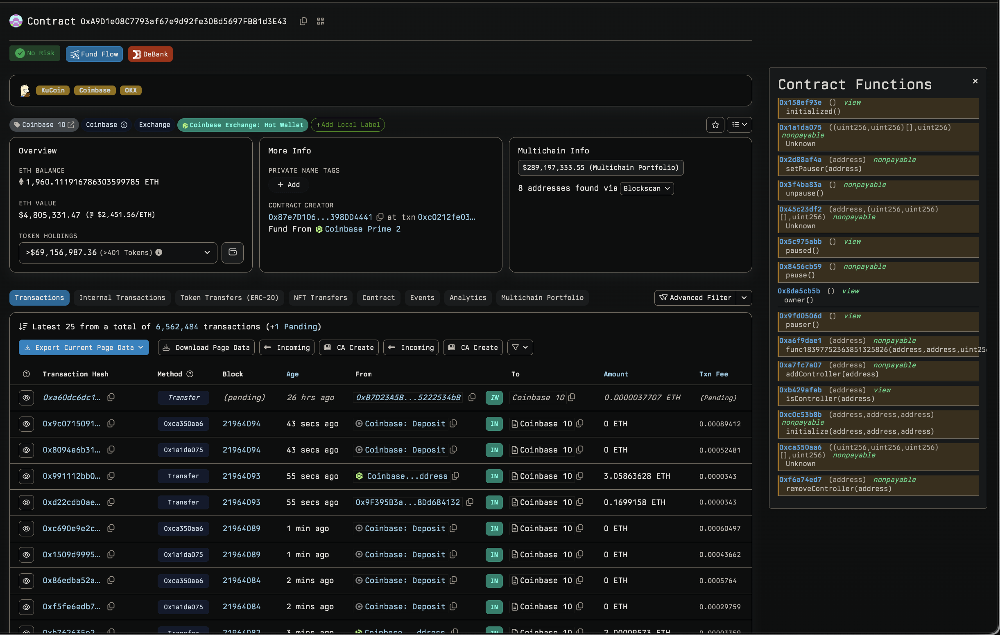
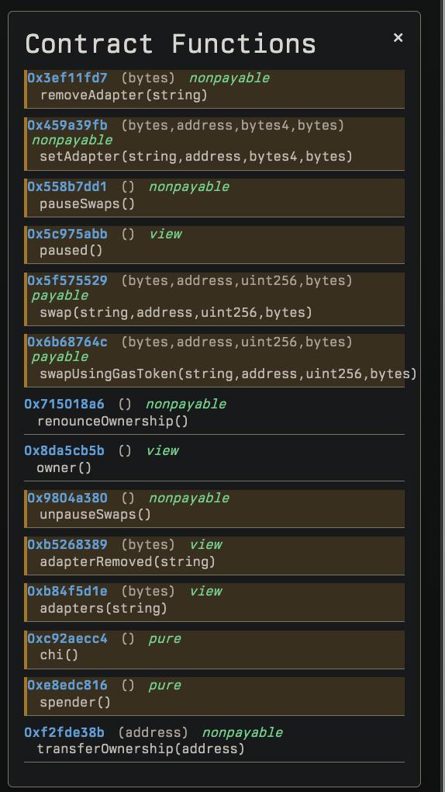

# Evmole for Etherscan

A Chrome extension that enhances Etherscan by displaying function selectors for Ethereum smart contracts. Primarily for unverified contracts, but can also be used for verified contracts.

## Features

- Automatically detects contract pages on Etherscan
- Displays function selectors in a clean, floating panel
- Shows function signatures and their corresponding 4-byte selectors
- Easy to use with a non-intrusive interface
- Purposely does not highlight erc20 functions

## Examples

*Contract overview with function selector panel*

*Detailed view of contract functions with selectors*

## Installation

1. Clone this repository
2. Open Chrome and navigate to `chrome://extensions/`
3. Enable "Developer mode" in the top right
4. Click "Load unpacked" and select the extension directory

## Usage

1. Visit any contract page on Etherscan (e.g., https://etherscan.io/address/[contract_address])
2. The extension will automatically detect the contract and display function selectors
3. Use the floating panel to view function signatures and their selectors
4. Click the close button (×) to dismiss the panel

## Permissions

The extension requires minimal permissions:
- `activeTab` - To interact with Etherscan pages

## Security

- No external API calls
- Only runs on Etherscan domains
- No data collection or tracking

## TODO 

- add support for other etherscan forks

## Credits

This extension uses [EVMole](https://github.com/cdump/evmole) for extracting function selectors and contract information from EVM bytecode.
