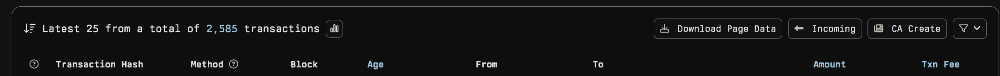

# Evmole for Etherscan QOL

A Chrome extension that enhances blockchain explorers with function selectors and quality-of-life improvements for Ethereum and multi-chain contract analysis.

## Features

### 🔍 Contract Function Analysis
- Automatically detects contract pages on supported blockchain explorers
- Shows function signatures and their corresponding 4-byte selectors
- Purposely does not highlight standard ERC20 functions

### ⚡ Quality of Life Enhancements
- **Quick Navigation Buttons**: Added "Incoming" and "CA Create" buttons for fast access to:
  - Incoming transactions 
  - Contract creation transactions 
- **Auto-Select 100 Records**: Automatically sets transaction lists to show 100 records per page for better data viewing
- **Multi-Chain Support**: Works across all major EVM blockchain explorers

### 🌐 Supported Blockchain Explorers
- Etherscan (Ethereum)
- Basescan (Base)
- Blastscan (Blast)
- BSCScan (Binance Smart Chain)
- Arbiscan (Arbitrum)
- Snowtrace/Snowscan (Avalanche)
- Polygonscan (Polygon)
- Optimistic Etherscan (Optimism)
- Lineascan (Linea)
- Worldscan (World Chain)
- Abscan (Abstract)
- Era.zksync (zkSync Era)
- Scrollscan (Scroll)
- And more...

## Examples

### Function Selector Analysis

*Contract overview with function selector panel*

*Detailed view of contract functions with selectors*

### Quality of Life Features

*Quick navigation buttons: "Incoming" and "CA Create" buttons automatically added next to Download Page Data for easy transaction filtering*

## Installation

1. Clone this repository
2. Open Chrome and navigate to `chrome://extensions/`
3. Enable "Developer mode" in the top right
4. Click "Load unpacked" and select the extension directory

## Usage

### Function Selector Analysis
1. Visit any contract page on supported blockchain explorers (e.g., https://etherscan.io/address/[contract_address])
2. The extension will automatically detect the contract and display function selectors in a floating panel
3. View function signatures and their corresponding 4-byte selectors
4. Click the close button (×) to dismiss the panel

### Quality of Life Features
1. **Quick Navigation**: On transaction list pages, use the "Incoming" and "CA Create" buttons to quickly filter transactions
2. **Auto-100 Records**: Transaction lists automatically show 100 records per page for better data viewing
3. **Multi-Chain**: All features work seamlessly across supported blockchain explorers

## Security

- No external API calls
- Only runs on trusted blockchain explorer domains
- No data collection or tracking
- Local processing of contract data only

## Credits

This extension uses [EVMole](https://github.com/cdump/evmole) for extracting function selectors and contract information from EVM bytecode.
