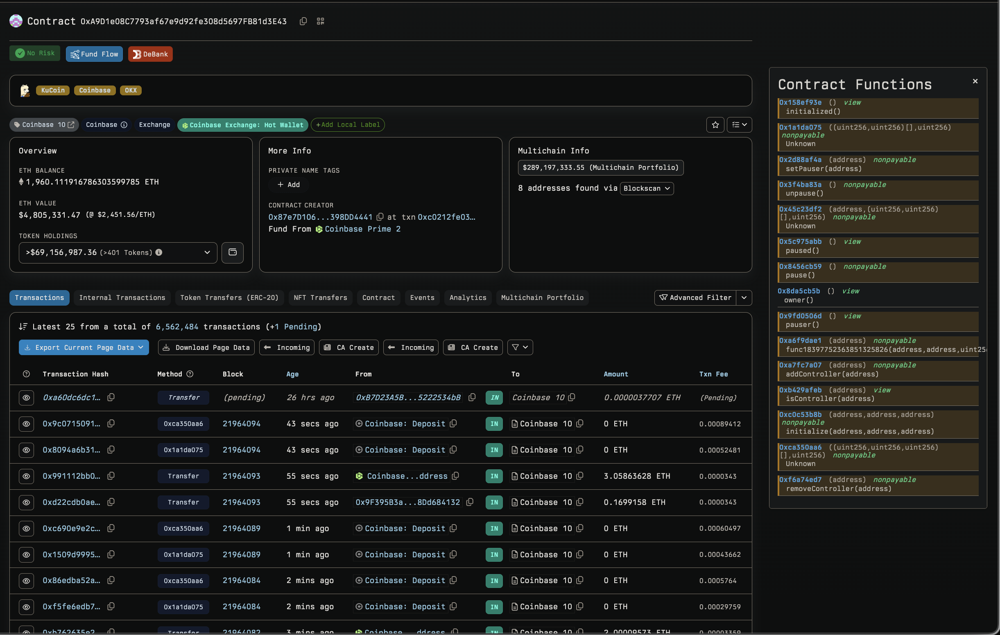
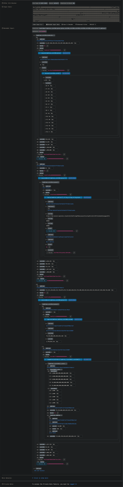

# Evmole for Etherscan QOL

Chrome extension for Etherscan-style explorers that adds contract-analysis and transaction-page quality-of-life tooling.

## What It Adds

- Contract function selector panel on `address/*` and `token/*` pages
- Transaction input calldata decoding on `tx/*` pages
- Transaction receipt event-log data is inferred locally and pre-populated before the Logs tab is opened
- Optional Postgres-backed private signature resolver for selectors missing from public datasets
- List-page QOL actions like quick "Incoming" / "CA Create" filters
- Auto-sets transaction list page size to 100 when supported

Supported explorers include Etherscan, Basescan, Blastscan, BSCScan, Arbiscan, Snowtrace/Snowscan, Polygonscan, Optimistic Etherscan, Lineascan, Worldscan, Scrollscan, and other Etherscan-family scanners configured in `manifest.json`.

## Screenshot

## Install

1. Clone this repository.
2. Open `chrome://extensions/`.
3. Enable `Developer mode`.
4. Click `Load unpacked` and select this folder.

## Notes

- The extension runs only on explorer domains listed in `manifest.json`.
- RPC endpoints for supported explorers live in `chain-rpcs.json`.
- Event-log handling uses topics and data already rendered on the transaction page, including a background fetch of the normal `/tx/*` page so decoded Logs content is ready when the tab is opened. Rows with a native ABI option are left native and defaulted to ABI; rows that already have a native event name are left native; unnamed Dec/Hex-only rows use the inferred decoder. It does not make RPC calls.
- It does not include analytics or user tracking.
- Signature decoding may query public signature services when a selector is unknown locally.
- Private selector signatures can be served from the optional resolver in `signature-db/`.

## Credits

- [EVMole](https://github.com/cdump/evmole) for selector extraction from bytecode.
- [abi-guesser](https://github.com/openchainxyz/abi-guesser) for ABI inference techniques that informed calldata decoding behavior.
- [swiss-knife](https://github.com/swiss-knife-xyz/swiss-knife) for EVM calldata decoding inspiration and reference patterns.
